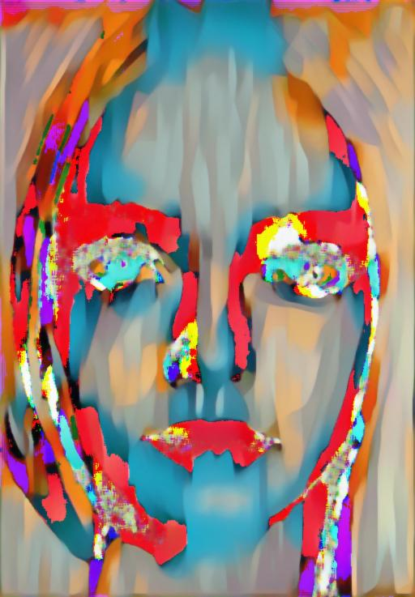
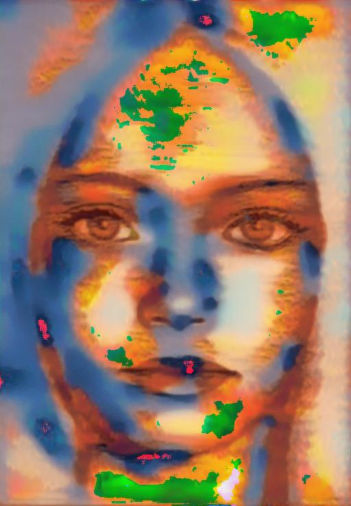
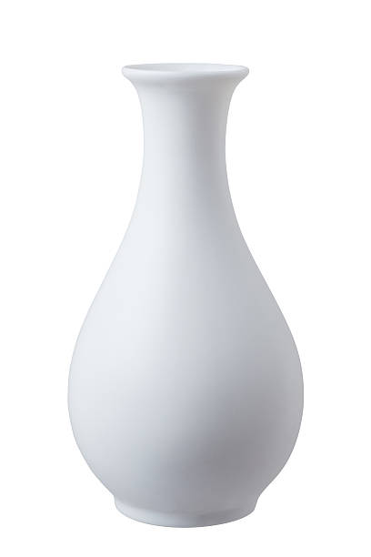
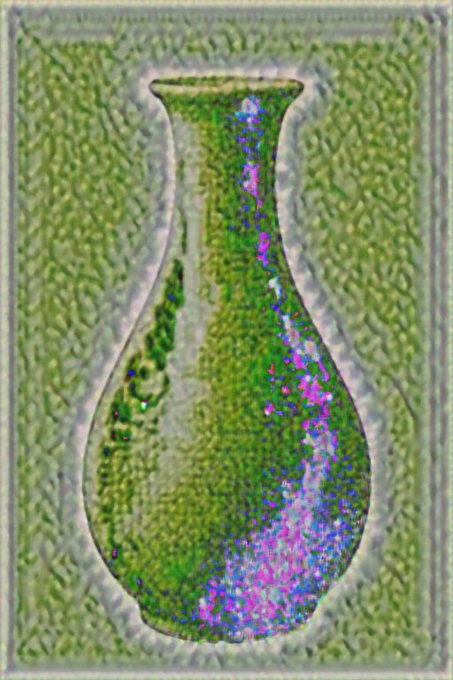
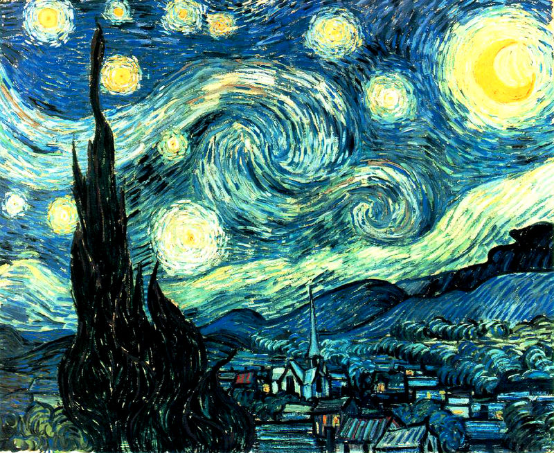

# Artistic Style Transfer

This repository contains a Python implementation of artistic style transfer, a technique that combines the content of one image with the style of another.

**How it works:**

1. **Load Images:** Load the content image and the style image.
2. **Preprocess Images:** Convert the images to tensors and preprocess them for the neural network (e.g., normalization).
3. **Load Pre-trained Model:** Load a pre-trained neural network (e.g., VGG19) to extract features from the images.
4. **Define Loss Functions:** Define loss functions to:
   - **Content Loss:** Minimize the difference between the content features of the generated image and the content image.
   - **Style Loss:** Minimize the difference between the style features of the generated image and the style image.
   - **Total Variation Loss:** Encourage smoothness in the generated image.
5. **Optimization:** Use an optimization algorithm (e.g., L-BFGS) to minimize the total loss. This process iteratively adjusts the generated image to match the content and style.
6. **Save and Visualize:** Save the generated image and visualize the results.

**Requirements:**

- Python 3.x
- PyTorch
- torchvision
- Matplotlib (for visualization)

**Examples:**

| Content Image                           | Style Image                                  | Processed image                                        |
|-----------------------------------------|----------------------------------------------|--------------------------------------------------------|
|  |    |   |
|  |     |    |
|  |  |  |
|  |  |  |
